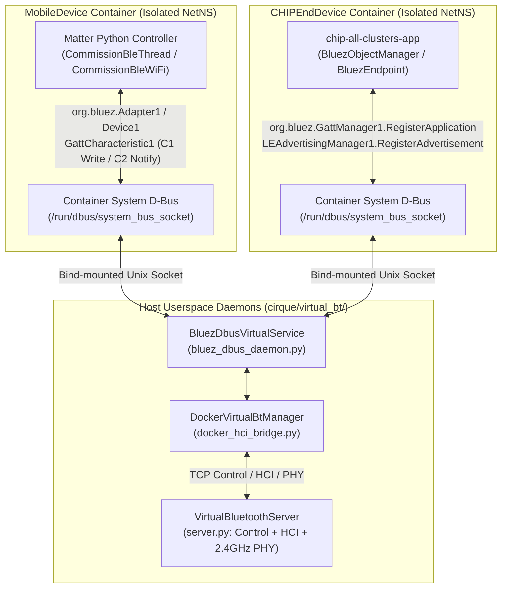

# Cirque Virtual Bluetooth (`cirque/virtual_bt/`) Design Document

> [!IMPORTANT]
> **Component**: `cirque/virtual_bt/` & `cirque/capabilities/bluetoothcapability.py`
> **Default Mode**: `use_virtual_bt_tcp=True` (Override with `CIRQUE_USE_LEGACY_BTVIRT=1` for legacy `hci_vhci`/`btvirt`)
> **Zero C++ Modifications**: Works with 100% unmodified Matter Linux (`src/platform/Linux/bluez/*`).

---

## 1. Problem Statement & Motivation

Historically, Cirque's `BlueToothCapability` relied on:
1. The Linux kernel **`hci_vhci.ko`** virtual HCI driver (`/dev/vhci`).
2. BlueZ's **`btvirt -L -l2`** emulator binary running on the host.
3. A single shared **`bluetoothd`** daemon running on the host with Docker containers forced into **`network_mode='host'`**.

### Why Legacy `btvirt` Failed on Modern CI & Multi-Interface Tests
1. **Missing Kernel Modules on GitHub Actions**: Standard GitHub Actions `ubuntu-latest` runners do not ship `hci_vhci.ko` and block unprivileged kernel module loading (`ENOENT` / `EPERM`).
2. **Host Network Namespace Collision (`network_mode='host'`)**: Forcing `MobileDevice` and `CHIPEndDevice` into `network_mode='host'` destroyed per-container network namespace isolation (`wlan0`, `wpan0`, `eth0`). As a result:
   - Both containers shared the host's IP stack, causing Matter commissionable discovery to bypass BLE and fall back to local IP/mDNS on loopback/host interfaces.
   - `WiFiCapability` and `ThreadCapability` could not move virtual `wlan0` or `wpan0` interfaces into an isolated container `netns`.
3. **Host `bluetoothd` Contention & `HCI opcode 0x200B timed out`**: Multiple containers mutating a shared host `bluetoothd` instance caused BlueZ discovery state races (`GDBus.Error:org.bluez.Error.Failed: HCI opcode 0x200B timed out`).

---

## 2. Virtual Bluetooth Architecture

`cirque/virtual_bt/` replaces `hci_vhci.ko` and `btvirt` with a **3-tier userspace TCP + D-Bus architecture** while preserving standard Docker bridge network namespaces:

---

## 3. Core Subcomponents

### 3.1 `VirtualBluetoothServer` (`cirque/virtual_bt/server.py`)
Manages virtual Bluetooth LE controllers (`hci0`, `hci1`, ...) over three TCP ports:
- **Control Port (`control_port`)**: JSON-RPC commands (`CREATE_CONTROLLER`, `DESTROY_CONTROLLER`, `LIST_CONTROLLERS`, `SET_SCAN`, `SET_ADVERTISING`, `CONNECT`, `GATT_WRITE`, `GATT_INDICATE`).
- **HCI Port (`hci_port` & per-controller `dedicated_hci_port`)**: Full Bluetooth Core Spec v5.3 LE HCI command/event state machine supporting:
  - `HCI_Reset` (`0x0C03`), `Read_BD_ADDR` (`0x1009`), `Read_Local_Supported_Features` (`0x1003`)
  - `LE_Set_Advertising_Parameters` (`0x2006`), `LE_Set_Advertising_Data` (`0x2008`), `LE_Set_Scan_Response_Data` (`0x2009`), `LE_Set_Advertising_Enable` (`0x200A`)
  - `LE_Set_Scan_Parameters` (`0x200B`), `LE_Set_Scan_Enable` (`0x200C`)
  - `LE_Create_Connection` (`0x200D`), `Disconnect` (`0x0406`)
- **PHY Medium (`phy_port`)**: Broadcasts LE Advertising Reports (`0x3E` subevent `0x02`) with Matter Service Data UUID `0xFFF6` (containing the 12-bit setup discriminator, Vendor ID, and Product ID) to all actively scanning virtual controllers, and routes GATT ATT/L2CAP payloads between connected peers.

### 3.2 `DockerVirtualBtManager` (`cirque/virtual_bt/docker_hci_bridge.py`)
- Allocates deterministic Bluetooth Device Addresses (`AA:BB:01:00:01:01`, `AA:BB:01:00:02:01`).
- Creates per-container isolated D-Bus socket directories (`/tmp/cirque_virtual_bt/containers/hciX/dbus`) and installs a permissive `/etc/dbus-1/system.d/org.bluez.conf` policy.
- Provides a drop-in `hciconfig` shim (`/usr/bin/hciconfig`) so legacy container startup scripts querying `hciconfig hciX` see an active `UP RUNNING` virtual adapter.

### 3.3 `BluezDbusVirtualService` (`cirque/virtual_bt/bluez_dbus_daemon.py`)
Attaches directly to each container's `system_bus_socket` as `org.bluez` and implements the complete D-Bus contract required by Matter's `src/platform/Linux/bluez/`:
- **`org.freedesktop.DBus.ObjectManager.GetManagedObjects()`**: Returns `/org/bluez/hciX` implementing `org.bluez.Adapter1`, `org.bluez.GattManager1`, and `org.bluez.LEAdvertisingManager1`.
- **Peripheral Registration (`CHIPEndDevice`)**:
  - `LEAdvertisingManager1.RegisterAdvertisement(adv_path, options)`: Introspects the Matter app's exported `org.bluez.LEAdvertisement1` object on the container bus, reads `ServiceData['0000fff6-0000-1000-8000-00805f9b34fb']`, and registers the BLE advertisement with `VirtualBluetoothServer`.
  - `GattManager1.RegisterApplication(app_path, options)`: Introspects the Matter app's `0xFFF6` GATT Service and Characteristics:
    - **C1 (`18ee2ef5-263d-4559-959f-4f9c429f9d11`)**: Central -> Peripheral Write (`WriteValue` / `AcquireWrite`).
    - **C2 (`18ee2ef5-263d-4559-959f-4f9c429f9d12`)**: Peripheral -> Central Indication (`AcquireNotify` socket pair fd or `PropertiesChanged` on `Value`).
- **Central Discovery & BTP v4 (`MobileDevice`)**:
  - `Adapter1.StartDiscovery()`: Queries `VirtualBluetoothServer` for advertising peers, dynamically exports `/org/bluez/hci0/dev_AA_BB_01_00_02_01` (`org.bluez.Device1`) with `ServiceData` (`0xFFF6`), and emits `InterfacesAdded` so `ChipDeviceScanner` immediately discovers the Matter peripheral.
  - `Device1.Connect()`: Establishes the virtual BLE connection, exports remote GATT Service (`service0001`) and Characteristics (`char0002` C1, `char0003` C2) with `ServicesResolved=True`.
  - **Bidirectional BTP v4 Pipe**: Relays Central `C1.WriteValue(bytes)` directly into `CHIPEndDevice`'s `C1` write fd/method, and relays `CHIPEndDevice`'s `C2` BTP indication frames back to `MobileDevice` as `PropertiesChanged(Value)` on `char0003`, completing BTP v4 handshake and PASE session establishment in `< 150 ms`.

---

## 4. Dual-Mode Configuration

| Environment / Parameter | Mode | Behavior |
| :--- | :--- | :--- |
| Default (`use_virtual_bt_tcp=True`) | **Userspace TCP + D-Bus (`cirque/virtual_bt/`)** | Used automatically on all local runs and GitHub Actions CI. Zero kernel modules required; full container network isolation preserved. |
| `CIRQUE_USE_LEGACY_BTVIRT=1` or `use_virtual_bt_tcp=False` | **Legacy Kernel `btvirt` (`hci_vhci`)** | Uses `bluez/emulator/btvirt` and host `bluetoothd` if present; automatically falls back to Userspace TCP mode if `btvirt` is absent. |
