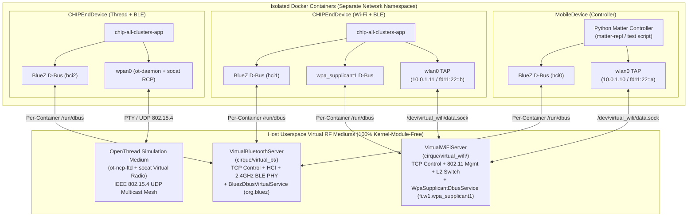

# Cirque Overall Virtual RF Architecture (`Virtual BT` + `Virtual Wi-Fi` + `Virtual Thread`)

> [!IMPORTANT]
> **Related Design Documents**:
> - [Virtual Bluetooth Design (`docs/VIRTUAL_BT_DESIGN.md`)](./VIRTUAL_BT_DESIGN.md)
> - [Virtual Wi-Fi Design (`docs/VIRTUAL_WIFI_DESIGN.md`)](./VIRTUAL_WIFI_DESIGN.md)

---

## 1. Executive Summary

Cirque simulates complex multi-node smart home topologies (`MobileDevice`,
`CHIPEndDevice`, `WiFiAPNode`, `ThreadBorderRouter`) inside Docker containers on
a single Linux host. To run reliably on **unprivileged GitHub Actions Linux
runners** and developer workstations without requiring root kernel modules
(`hci_vhci.ko`, `mac80211_hwsim.ko`) or host network namespace pollution
(`network_mode='host'`), Cirque uses a unified **Userspace D-Bus + TCP Virtual
Medium Architecture** across **Virtual Bluetooth** (`cirque/virtual_bt/`),
**Virtual Wi-Fi** (`cirque/virtual_wifi/`), and **Virtual Thread**
(`ThreadCapability`) while retaining opt-in dual-mode backward compatibility for
legacy kernel modules.

---

## 2. Comparison of the Three Virtual RF Subsystems

| Dimension | Virtual Bluetooth (`cirque/virtual_bt/`) | Virtual Wi-Fi (`cirque/virtual_wifi/`) | Virtual Thread (`ThreadCapability`) |
| :--- | :--- | :--- | :--- |
| **Replaced Legacy Dependency** | `hci_vhci.ko` + `bluez/emulator/btvirt` + host `bluetoothd` | `mac80211_hwsim.ko` + `hostapd` + `dnsmasq` | Hardware 802.15.4 USB dongle |
| **Control Plane Interface** | `org.bluez` D-Bus (`Adapter1`, `Device1`, `GattManager1`, `LEAdvertisingManager1`) | `fi.w1.wpa_supplicant1` D-Bus (`Interface`, `BSS`, `Network`) | `io.openthread.BorderRouter` / `ot-ctl` unix socket |
| **Data Plane Interface** | GATT Characteristic C1 Write / C2 Indication (BTP v4) over D-Bus / fd pipe | Container `wlan0` TAP interface bridged via `/dev/virtual_wifi/data.sock` | Container `wpan0` TUN interface managed by `ot-daemon` + `socat` PTY to `ot-ncp-ftd` |
| **Security & Isolation Gate** | GATT connections require active LE advertising (`0xFFF6`) + matching discriminator | L2 switch drops all frames until WPA2-PSK 4-way handshake reaches `state == 'completed'` | MeshCoP Thread Operational Dataset TLV (`NetworkKey`, `ExtendedPanId`, `Channel`) |
| **Shared D-Bus Coexistence** | Shares `/tmp/cirque_virtual_bt/containers/hciX/dbus` (`system_bus_socket`) | Attaches `fi.w1.wpa_supplicant1` onto the same container `system_bus_socket` when both BT and Wi-Fi are enabled | Runs `ot-daemon` against the same container `system_bus_socket` |
| **Legacy Opt-In Toggle** | `CIRQUE_USE_LEGACY_BTVIRT=1` | `CIRQUE_USE_LEGACY_HWSIM=1` | N/A |

---

## 3. Multi-Capability Container Coexistence (`Bluetooth` + `WiFi`)

- **INVARIANT**: A single `DockerNode` (such as `MobileDevice` or
  `CHIPEndDevice`) can enable `Bluetooth` and `WiFi` simultaneously on the same
  per-container `/run/dbus/system_bus_socket` via `BlueToothCapability` and
  `WiFiCapability`.

When both `BlueToothCapability` and `WiFiCapability` are attached to the same
`DockerNode`:
1. **Unified Container `/run/dbus` Mount**:
   - `BlueToothCapability.get_docker_run_args()` mounts
     `/tmp/cirque_virtual_bt/containers/hciX/dbus:/run/dbus`.
   - `WiFiCapability.get_docker_run_args()` detects the `BlueToothCapability` on
     the same `docker_node` and reuses that exact `/run/dbus` directory instead
     of adding a conflicting `/run/dbus` volume mount, while mounting
     `/etc/dbus-1/system.d/fi.w1.wpa_supplicant1.conf:ro` alongside
     `/etc/dbus-1/system.d/org.bluez.conf:ro`.
2. **Simultaneous D-Bus Service Registration**:
   - Inside the container, `dbus-daemon --system` starts and listens on
     `/run/dbus/system_bus_socket`.
   - `BlueToothCapability.enable_capability()` connects
     `BluezDbusVirtualService` to `/run/dbus/system_bus_socket` and claims bus
     name `org.bluez`.
   - `WiFiCapability.enable_capability()` connects `WpaSupplicantDbusService` to
     the same `/run/dbus/system_bus_socket` and claims bus name
     `fi.w1.wpa_supplicant1`.
   - The unmodified Matter binary (`chip-all-clusters-app`) connects once to
     `unix:path=/var/run/dbus/system_bus_socket` and seamlessly talks to both
     `org.bluez` (for BLE peripheral advertising & BTP v4) and
     `fi.w1.wpa_supplicant1` (for Wi-Fi scanning & station association).

---

## 4. Reusable Virtual Home Topology Builder (`cirque/home/virtual_home_topology.py`)

To allow external GitHub repositories and developers to spin up multi-container
Virtual Homes with simultaneous **Virtual Bluetooth** and **Virtual
Wi-Fi** in standard unprivileged CI runners (`ubuntu-latest`), Cirque
provides:

- **`VirtualHomeNodeSpec`** & **`VirtualHomeApSpec`**: Immutable dataclasses
  that compile declarative node/AP definitions into `CirqueHome` topology
  dictionaries with `use_virtual_bt_tcp=True` and `use_virtual_wifi_tcp=True`.
- **`VirtualHomeTopology.default_two_node_ble_wifi_config()`**: Builds the
  canonical 2-Docker-node (`mobile_controller` + `iot_end_device`) + `wifi_ap`
  topology.
- **`VirtualHomeTopology.verify_virtual_bt_between_nodes()`**: Powers on
  `org.bluez` `/org/bluez/$BLE_ADAPT`, registers BLE advertising on the IoT
  device, triggers BLE discovery on the controller, and returns
  `ObjectManager.GetManagedObjects` discovery results.
- **`VirtualHomeTopology.verify_virtual_wifi_commissioning_and_data_plane()`**:
  Executes `fi.w1.wpa_supplicant1` D-Bus `GetInterface`, `Scan`, `AddNetwork`,
  and `SelectNetwork`, runs `dhcpcd wlan0`, and verifies 0% packet loss ICMP
  ping across `wlan0`.
- **`examples/run_virtual_home_interactive.py`**: Interactive 2-Docker + Virtual
  AP launcher registering BLE GATT services (`0x180A`, `0x180F`) and LE
  advertisements (`0xFFF6`) on `IoTEndDevice`.
- **`examples/validate_virtual_home.sh`** &
  **`examples/bluetoothctl_dbus_cli.py`**: Automated CLI validation suite
  verifying `hciconfig`, `bluetoothctl`, `dbus-send`, `gdbus`, `iwlist wlan0
  scan`, WPA2 association, `dhcpcd wlan0`, and ICMP ping across `wlan0`.
- **`cirque/resources/Dockerfile.virtual_rf_node`**: Lightweight Ubuntu 22.04
  container image (`dbus`, `bluez`, `libglib2.0-bin`, `python3-dbus`,
  `python3-gi`, `iproute2`, `iputils-ping`, `dhcpcd5`, `dnsmasq`) built in
  GitHub Actions as `project-chip/chip-cirque-device-base`.

---

## 5. End-to-End CI Test Matrix & Code Coverage Gate

- **Unit Tests + Coverage Gate**
  (`cirque/virtual_wifi/test_virtual_wifi_server.py`,
  `coverage report --fail-under=95`):
  - **Radios Exercised**: Virtual Wi-Fi + Virtual Home Topology.
  - **What It Gates**: Enforces **>=95% statement coverage** across
    `cirque/virtual_wifi/*` and `cirque/home/virtual_home_topology.py` (`< 2s`).
- **2-Docker Virtual Home E2E (Cirque CI)**
  (`examples/test_virtual_home_ble_wifi_e2e.py`,
  `cirque/capabilities/test/test_bluetooth_capability.py`,
  `cirque/capabilities/test/test_wifi_capability.py`):
  - **Radios Exercised**: Virtual BT (`hci0`/`hci1`) + Virtual Wi-Fi (`wlan0` +
    `WiFiAPNode`).
  - **What It Gates**: Spawns `mobile_controller`, `iot_end_device`, and
    `wifi_ap` Docker containers on GitHub Actions `ubuntu-latest` and verifies
    cross-container BLE discovery (`AA:BB:CC:DD:EE:01` <-> `AA:BB:CC:DD:EE:02`),
    WPA2 D-Bus association, DHCP IPv4 (`10.0.1.11` <-> `10.0.1.12`), and 0%
    packet loss ICMP ping over `wlan0`.
- **`BleMobileDeviceTest`**
  (`src/test_driver/linux-cirque/BleMobileDeviceTest.py`,
  `src/controller/python/tests/scripts/mobile-device-ble-test.py`):
  - **Radios Exercised**: Virtual BT (`hci0`/`hci1`) + Virtual Thread (`wpan0`).
  - **What It Gates**: Pure BLE Discovery + BTP v4 + PASE + Thread Operational
    Dataset provisioning (`CommissionBleThread`) + IPv6 Thread Operational CASE
    (`eth0` disabled).
- **`BleWiFiMobileDeviceTest`**
  (`src/test_driver/linux-cirque/BleWiFiMobileDeviceTest.py`,
  `src/controller/python/tests/scripts/mobile-device-ble-wifi-test.py`):
  - **Radios Exercised**: Virtual BT (`hci0`/`hci1`) + Virtual Wi-Fi (`wlan0` +
    `WiFiAPNode`).
  - **What It Gates**: Pre-commissioning `wlan0` L2 isolation (`ping` fails) ->
    Pure BLE Discovery + BTP v4 + PASE + Wi-Fi WPA2 provisioning
    (`CommissionBleWiFi`) -> `wlan0` L2 gate unlock + IPv6 Operational CASE
    (`eth0` disabled).

---

## 6. Central Symbols & Pedagogical Reading Order

### Top Central Symbols by PageRank
1. **`VirtualBtControlClient.request`** (`cirque/virtual_bt/client.py`,
   PageRank `0.001525`): JSON-RPC client entry point for controller lifecycle
   and PHY impairment commands.
2. **`VirtualBluetoothController.emit_h4`** (`cirque/virtual_bt/controller.py`,
   PageRank `0.001443`): Fan-out hub dispatching framed H4 Event and ACL
   packets to all TCP sinks.
3. **`dbus_send`** (`examples/bluetoothctl_dbus_cli.py`, PageRank `0.001337`):
   Container D-Bus command runner backing `bluetoothctl` CLI validation.
4. **`VirtualHomeTopology._exec_in_node`**
   (`cirque/home/virtual_home_topology.py`, PageRank `0.001316`): Container
   command execution bridge for E2E BLE and Wi-Fi verification.
5. **`H4TcpClient._pop_matching_opcode_event`** (`cirque/virtual_bt/client.py`,
   PageRank `0.000899`): Synchronous HCI Command Complete / Command Status
   event matcher.
6. **`VirtualBluetoothServer._bind_listener`** (`cirque/virtual_bt/server.py`,
   PageRank `0.000856`): Binds Control, H4 HCI, PHY, and dedicated
   per-controller TCP sockets.
7. **`BluezDbusVirtualService._all_connections`**
   (`cirque/virtual_bt/bluez_dbus_daemon.py`, PageRank `0.000844`): Broadcasts
   `InterfacesAdded` and `PropertiesChanged` across container buses.
8. **`VirtualWiFiServer._bind_tcp`** (`cirque/virtual_wifi/server.py`,
   PageRank `0.000801`): Binds Control, 802.11 Management, and
   Association-Gated L2 Switch TCP ports.

### 5-Step Pedagogical Reading Order
1. **Step 1 — Declarative Topology & Interactive Entry Points**:
   `cirque/home/virtual_home_topology.py` ->
   `examples/run_virtual_home_interactive.py` ->
   `examples/validate_virtual_home.sh`.
2. **Step 2 — Capability & Node Lifecycle Orchestration**:
   `cirque/capabilities/bluetoothcapability.py` ->
   `cirque/capabilities/wificapability.py` -> `cirque/nodes/wifiapnode.py` ->
   `cirque/home/home.py`.
3. **Step 3 — Container D-Bus & Socket Bridges**:
   `cirque/virtual_bt/bluez_dbus_daemon.py` ->
   `cirque/virtual_bt/bluez_gatt_mixin.py` ->
   `cirque/virtual_wifi/wpa_dbus_daemon.py` ->
   `cirque/virtual_wifi/docker_wifi_bridge.py`.
4. **Step 4 — Core RF Medium & Protocol State Machines**:
   `cirque/virtual_bt/hci_h4.py` -> `cirque/virtual_bt/link_layer.py` ->
   `cirque/virtual_bt/controller.py` -> `cirque/virtual_bt/server.py` ->
   `cirque/virtual_wifi/server.py`.
5. **Step 5 — Unit & E2E Verification Suites**:
   `cirque/capabilities/test/test_bluetooth_capability.py` ->
   `cirque/virtual_wifi/test_virtual_wifi_server.py` ->
   `examples/test_virtual_home_ble_wifi_e2e.py`.

