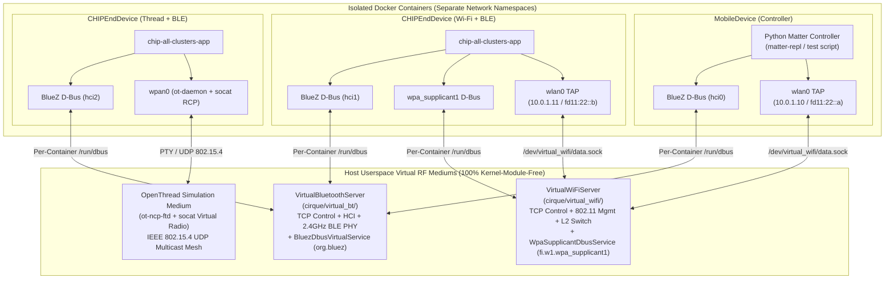
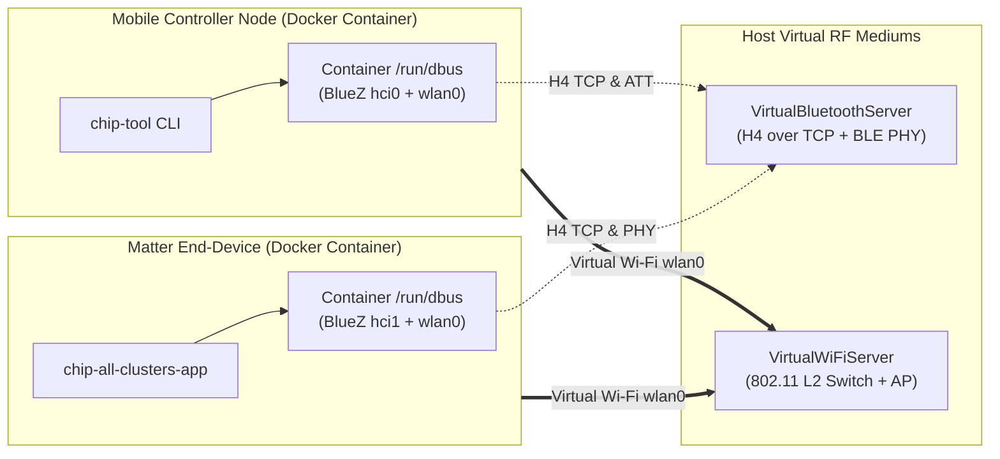

# Cirque Overall Virtual RF Architecture (`Virtual BT` + `Virtual Wi-Fi` + `Virtual Thread`)

> [!IMPORTANT]
> **Related Design Documents**:
> - [Virtual Bluetooth Design (`docs/VIRTUAL_BT_DESIGN.md`)](./VIRTUAL_BT_DESIGN.md)
> - [Virtual Wi-Fi Design (`docs/VIRTUAL_WIFI_DESIGN.md`)](./VIRTUAL_WIFI_DESIGN.md)

---

## 1. Executive Summary

Cirque simulates complex multi-node smart home topologies (`MobileDevice`,
`CHIPEndDevice`, `WiFiAPNode`, `ThreadBorderRouter`) inside Docker containers on
a single Linux host. To run reliably on **unprivileged GitHub Actions Linux
runners** and developer workstations without requiring root kernel modules
(`hci_vhci.ko`, `mac80211_hwsim.ko`) or host network namespace pollution
(`network_mode='host'`), Cirque uses a unified **Userspace D-Bus + TCP Virtual
Medium Architecture** across **Virtual Bluetooth** (`cirque/virtual_bt/`),
**Virtual Wi-Fi** (`cirque/virtual_wifi/`), and **Virtual Thread**
(`ThreadCapability`) while retaining opt-in dual-mode backward compatibility for
legacy kernel modules.

```mermaid
flowchart TB
    subgraph Containers["Isolated Docker Containers (Separate Network Namespaces)"]
        direction LR
        subgraph Mobile["MobileDevice (Controller)"]
            M_App["Python Matter Controller\n(matter-repl / test script)"]
            M_HCI["BlueZ D-Bus (hci0)"]
            M_WLAN["wlan0 TAP\n(10.0.1.10 / fd11:22::a)"]
            M_App --> M_HCI
            M_App --> M_WLAN
        end

        subgraph EndWiFi["CHIPEndDevice (Wi-Fi + BLE)"]
            EW_App["chip-all-clusters-app"]
            EW_HCI["BlueZ D-Bus (hci1)"]
            EW_WPA["wpa_supplicant1 D-Bus"]
            EW_WLAN["wlan0 TAP\n(10.0.1.11 / fd11:22::b)"]
            EW_App --> EW_HCI
            EW_App --> EW_WPA
            EW_App --> EW_WLAN
        end

        subgraph EndThread["CHIPEndDevice (Thread + BLE)"]
            ET_App["chip-all-clusters-app"]
            ET_HCI["BlueZ D-Bus (hci2)"]
            ET_WPAN["wpan0 (ot-daemon + socat RCP)"]
            ET_App --> ET_HCI
            ET_App --> ET_WPAN
        end
    end

    subgraph HostMediums["Host Userspace Virtual RF Mediums (100% Kernel-Module-Free)"]
        direction LR
        VBT["VirtualBluetoothServer\n(cirque/virtual_bt/)\nTCP Control + HCI + 2.4GHz BLE PHY\n+ BluezDbusVirtualService (org.bluez)"]
        VWIFI["VirtualWiFiServer\n(cirque/virtual_wifi/)\nTCP Control + 802.11 Mgmt + L2 Switch\n+ WpaSupplicantDbusService (fi.w1.wpa_supplicant1)"]
        VTHREAD["OpenThread Simulation Medium\n(ot-ncp-ftd + socat Virtual Radio)\nIEEE 802.15.4 UDP Multicast Mesh"]
    end

    M_HCI <-->|"Per-Container /run/dbus"| VBT
    EW_HCI <-->|"Per-Container /run/dbus"| VBT
    ET_HCI <-->|"Per-Container /run/dbus"| VBT

    EW_WPA <-->|"Per-Container /run/dbus"| VWIFI
    M_WLAN <-->|"/dev/virtual_wifi/data.sock"| VWIFI
    EW_WLAN <-->|"/dev/virtual_wifi/data.sock"| VWIFI

    ET_WPAN <-->|"PTY / UDP 802.15.4"| VTHREAD
```

---

## 2. Comparison of the Three Virtual RF Subsystems

| Dimension | Virtual Bluetooth (`cirque/virtual_bt/`) | Virtual Wi-Fi (`cirque/virtual_wifi/`) | Virtual Thread (`ThreadCapability`) |
| :--- | :--- | :--- | :--- |
| **Replaced Legacy Dependency** | `hci_vhci.ko` + `bluez/emulator/btvirt` + host `bluetoothd` | `mac80211_hwsim.ko` + `hostapd` + `dnsmasq` | Hardware 802.15.4 USB dongle |
| **Control Plane Interface** | `org.bluez` D-Bus (`Adapter1`, `Device1`, `GattManager1`, `LEAdvertisingManager1`) | `fi.w1.wpa_supplicant1` D-Bus (`Interface`, `BSS`, `Network`) | `io.openthread.BorderRouter` / `ot-ctl` unix socket |
| **Data Plane Interface** | GATT Characteristic C1 Write / C2 Indication (BTP v4) over D-Bus / fd pipe | Container `wlan0` TAP interface bridged via `/dev/virtual_wifi/data.sock` | Container `wpan0` TUN interface managed by `ot-daemon` + `socat` PTY to `ot-ncp-ftd` |
| **Security & Isolation Gate** | GATT connections require active LE advertising (`0xFFF6`) + matching discriminator | L2 switch drops all frames until WPA2-PSK 4-way handshake reaches `state == 'completed'` | MeshCoP Thread Operational Dataset TLV (`NetworkKey`, `ExtendedPanId`, `Channel`) |
| **Shared D-Bus Coexistence** | Shares `/tmp/cirque_virtual_bt/containers/hciX/dbus` (`system_bus_socket`) | Attaches `fi.w1.wpa_supplicant1` onto the same container `system_bus_socket` when both BT and Wi-Fi are enabled | Runs `ot-daemon` against the same container `system_bus_socket` |
| **Legacy Opt-In Toggle** | `CIRQUE_USE_LEGACY_BTVIRT=1` | `CIRQUE_USE_LEGACY_HWSIM=1` | N/A |

---

## 3. Multi-Capability Container Coexistence (`Bluetooth` + `WiFi`)

- **INVARIANT**: A single `DockerNode` (such as `MobileDevice` or
  `CHIPEndDevice`) can enable `Bluetooth` and `WiFi` simultaneously on the same
  per-container `/run/dbus/system_bus_socket` via `BlueToothCapability` and
  `WiFiCapability`.

When both `BlueToothCapability` and `WiFiCapability` are attached to the same
`DockerNode`:
1. **Unified Container `/run/dbus` Mount**:
   - `BlueToothCapability.get_docker_run_args()` mounts
     `/tmp/cirque_virtual_bt/containers/hciX/dbus:/run/dbus`.
   - `WiFiCapability.get_docker_run_args()` detects the `BlueToothCapability` on
     the same `docker_node` and reuses that exact `/run/dbus` directory instead
     of adding a conflicting `/run/dbus` volume mount, while mounting
     `/etc/dbus-1/system.d/fi.w1.wpa_supplicant1.conf:ro` alongside
     `/etc/dbus-1/system.d/org.bluez.conf:ro`.
2. **Simultaneous D-Bus Service Registration**:
   - Inside the container, `dbus-daemon --system` starts and listens on
     `/run/dbus/system_bus_socket`.
   - `BlueToothCapability.enable_capability()` connects
     `BluezDbusVirtualService` to `/run/dbus/system_bus_socket` and claims bus
     name `org.bluez`.
   - `WiFiCapability.enable_capability()` connects `WpaSupplicantDbusService` to
     the same `/run/dbus/system_bus_socket` and claims bus name
     `fi.w1.wpa_supplicant1`.
   - The unmodified Matter binary (`chip-all-clusters-app`) connects once to
     `unix:path=/var/run/dbus/system_bus_socket` and seamlessly talks to both
     `org.bluez` (for BLE peripheral advertising & BTP v4) and
     `fi.w1.wpa_supplicant1` (for Wi-Fi scanning & station association).

---

## 4. Reusable Virtual Home Topology Builder (`cirque/home/virtual_home_topology.py`)

To allow external GitHub repositories and developers to spin up multi-container
Virtual Homes with simultaneous **Virtual Bluetooth** and **Virtual
Wi-Fi** in standard unprivileged CI runners (`ubuntu-latest`), Cirque
provides:

- **`VirtualHomeNodeSpec`** & **`VirtualHomeApSpec`**: Immutable dataclasses
  that compile declarative node/AP definitions into `CirqueHome` topology
  dictionaries with `use_virtual_bt_tcp=True` and `use_virtual_wifi_tcp=True`.
- **`VirtualHomeTopology.default_two_node_ble_wifi_config()`**: Builds the
  canonical 2-Docker-node (`mobile_controller` + `iot_end_device`) + `wifi_ap`
  topology.
- **`VirtualHomeTopology.verify_virtual_bt_between_nodes()`**: Powers on
  `org.bluez` `/org/bluez/$BLE_ADAPT`, registers BLE advertising on the IoT
  device, triggers BLE discovery on the controller, and returns
  `ObjectManager.GetManagedObjects` discovery results.
- **`VirtualHomeTopology.verify_virtual_wifi_commissioning_and_data_plane()`**:
  Executes `fi.w1.wpa_supplicant1` D-Bus `GetInterface`, `Scan`, `AddNetwork`,
  and `SelectNetwork`, runs `dhcpcd wlan0`, and verifies 0% packet loss ICMP
  ping across `wlan0`.
- **`examples/run_virtual_home_interactive.py`**: Interactive 2-Docker + Virtual
  AP launcher registering BLE GATT services (`0x180A`, `0x180F`) and LE
  advertisements (`0xFFF6`) on `IoTEndDevice`.
- **`examples/validate_virtual_home.sh`** &
  **`examples/bluetoothctl_dbus_cli.py`**: Automated CLI validation suite
  verifying `hciconfig`, `bluetoothctl`, `dbus-send`, `gdbus`, `iwlist wlan0
  scan`, WPA2 association, `dhcpcd wlan0`, and ICMP ping across `wlan0`.
- **`cirque/resources/Dockerfile.virtual_rf_node`**: Lightweight Ubuntu 22.04
  container image (`dbus`, `bluez`, `libglib2.0-bin`, `python3-dbus`,
  `python3-gi`, `iproute2`, `iputils-ping`, `dhcpcd5`, `dnsmasq`) built in
  GitHub Actions as `cirque-device-base:latest` and
  `cirque-virtual-rf-node:latest`.

---

## 5. End-to-End CI Test Matrix & Code Coverage Gate

- **Unit Tests + Coverage Gate**
  (`cirque/virtual_wifi/test_virtual_wifi_server.py`,
  `coverage report --fail-under=95`):
  - **Radios Exercised**: Virtual Wi-Fi + Virtual Home Topology.
  - **What It Gates**: Enforces **>=95% statement coverage** across
    `cirque/virtual_wifi/*` and `cirque/home/virtual_home_topology.py` (`< 2s`).
- **2-Docker Virtual Home E2E (Cirque CI)**
  (`examples/test_virtual_home_ble_wifi_e2e.py`,
  `cirque/capabilities/test/test_bluetooth_capability.py`,
  `cirque/capabilities/test/test_wifi_capability.py`):
  - **Radios Exercised**: Virtual BT (`hci0`/`hci1`) + Virtual Wi-Fi (`wlan0` +
    `WiFiAPNode`).
  - **What It Gates**: Spawns `mobile_controller`, `iot_end_device`, and
    `wifi_ap` Docker containers on GitHub Actions `ubuntu-latest` and verifies
    cross-container BLE discovery (`AA:BB:CC:DD:EE:01` <-> `AA:BB:CC:DD:EE:02`),
    WPA2 D-Bus association, DHCP IPv4 (`10.0.1.11` <-> `10.0.1.12`), and 0%
    packet loss ICMP ping over `wlan0`.
- **`BleMobileDeviceTest`**
  (`src/test_driver/linux-cirque/BleMobileDeviceTest.py`,
  `src/controller/python/tests/scripts/mobile-device-ble-test.py`):
  - **Radios Exercised**: Virtual BT (`hci0`/`hci1`) + Virtual Thread (`wpan0`).
  - **What It Gates**: Pure BLE Discovery + BTP v4 + PASE + Thread Operational
    Dataset provisioning (`CommissionBleThread`) + IPv6 Thread Operational CASE.
- **`BleWiFiMobileDeviceTest`**
  (`src/test_driver/linux-cirque/BleWiFiMobileDeviceTest.py`,
  `src/controller/python/tests/scripts/mobile-device-ble-wifi-test.py`):
  - **Radios Exercised**: Virtual BT (`hci0`/`hci1`) + Virtual Wi-Fi (`wlan0` +
    `WiFiAPNode`).
  - **What It Gates**: Pre-commissioning `wlan0` L2 isolation (`ping` fails) ->
    Pure BLE Discovery + BTP v4 + PASE + Wi-Fi WPA2 provisioning
    (`CommissionBleWiFi`) -> `wlan0` L2 gate unlock + IPv6 Operational CASE
    (`eth0` disabled via `BleWiFiMobileDeviceTest.py#L117-L133`).

---

## 6. Central Symbols & Pedagogical Reading Order

### Top Central Symbols by PageRank
1. **`VirtualBtControlClient.request`** (`cirque/virtual_bt/client.py`,
   PageRank `0.001525`): JSON-RPC client entry point for controller lifecycle
   and PHY impairment commands.
2. **`VirtualBluetoothController.emit_h4`** (`cirque/virtual_bt/controller.py`,
   PageRank `0.001443`): Fan-out hub dispatching framed H4 Event and ACL
   packets to all TCP sinks.
3. **`dbus_send`** (`examples/bluetoothctl_dbus_cli.py`, PageRank `0.001337`):
   Container D-Bus command runner backing `bluetoothctl` CLI validation.
4. **`VirtualHomeTopology._exec_in_node`**
   (`cirque/home/virtual_home_topology.py`, PageRank `0.001316`): Container
   command execution bridge for E2E BLE and Wi-Fi verification.
5. **`H4TcpClient._pop_matching_opcode_event`** (`cirque/virtual_bt/client.py`,
   PageRank `0.000899`): Synchronous HCI Command Complete / Command Status
   event matcher.
6. **`VirtualBluetoothServer._bind_listener`** (`cirque/virtual_bt/server.py`,
   PageRank `0.000856`): Binds Control, H4 HCI, PHY, and dedicated
   per-controller TCP sockets.
7. **`BluezDbusVirtualService._all_connections`**
   (`cirque/virtual_bt/bluez_dbus_daemon.py`, PageRank `0.000844`): Broadcasts
   `InterfacesAdded` and `PropertiesChanged` across container buses.
8. **`VirtualWiFiServer._bind_tcp`** (`cirque/virtual_wifi/server.py`,
   PageRank `0.000801`): Binds Control, 802.11 Management, and
   Association-Gated L2 Switch TCP ports.

### 5-Step Pedagogical Reading Order
1. **Step 1 — Declarative Topology & Interactive Entry Points**:
   `cirque/home/virtual_home_topology.py` ->
   `examples/run_virtual_home_interactive.py` ->
   `examples/validate_virtual_home.sh`.
2. **Step 2 — Capability & Node Lifecycle Orchestration**:
   `cirque/capabilities/bluetoothcapability.py` ->
   `cirque/capabilities/wificapability.py` -> `cirque/nodes/wifiapnode.py` ->
   `cirque/home/home.py`.
3. **Step 3 — Container D-Bus & Socket Bridges**:
   `cirque/virtual_bt/bluez_dbus_daemon.py` ->
   `cirque/virtual_bt/bluez_gatt_mixin.py` ->
   `cirque/virtual_wifi/wpa_dbus_daemon.py` ->
   `cirque/virtual_wifi/docker_wifi_bridge.py`.
4. **Step 4 — Core RF Medium & Protocol State Machines**:
   `cirque/virtual_bt/hci_h4.py` -> `cirque/virtual_bt/link_layer.py` ->
   `cirque/virtual_bt/controller.py` -> `cirque/virtual_bt/server.py` ->
   `cirque/virtual_wifi/server.py`.
5. **Step 5 — Unit & E2E Verification Suites**:
   `cirque/capabilities/test/test_bluetooth_capability.py` ->
   `cirque/virtual_wifi/test_virtual_wifi_server.py` ->
   `examples/test_virtual_home_ble_wifi_e2e.py`.

---

## 7. Real CHIP Stack & Headless Controller Architecture

Cirque provides multi-node Docker topology for testing Matter BLE-to-Wi-Fi
commissioning and operational CASE sessions using real compiled C++ binaries
(`chip-tool` and `chip-all-clusters-app`) over userspace virtual BlueZ D-Bus
and Virtual Wi-Fi server:

```mermaid
flowchart LR
    subgraph MobileCtrl["Mobile Controller Node (Docker Container)"]
        direction TB
        CHIPTool["chip-tool CLI"]
        DBUS_A["Container /run/dbus\n(BlueZ hci0 + wlan0)"]
        CHIPTool --> DBUS_A
    end

    subgraph MatterDev["Matter End-Device (Docker Container)"]
        direction TB
        MatterApp["chip-all-clusters-app"]
        DBUS_D["Container /run/dbus\n(BlueZ hci1 + wlan0)"]
        MatterApp --> DBUS_D
    end

    subgraph VirtualRF["Host Virtual RF Mediums"]
        direction TB
        VBT_S["VirtualBluetoothServer\n(H4 over TCP + BLE PHY)"]
        VWIFI_S["VirtualWiFiServer\n(802.11 L2 Switch + AP)"]
    end

    DBUS_A -.->|H4 TCP & ATT| VBT_S
    DBUS_D -.->|H4 TCP & PHY| VBT_S
    MobileCtrl == "Virtual Wi-Fi wlan0" ==> VWIFI_S
    MatterDev == "Virtual Wi-Fi wlan0" ==> VWIFI_S
```

### Runtime Environment & Hardware Virtualization Limits
1. **Linux Native CHIP Stack (`container_chiptool`)**:
   Standard execution mode for containerized CI and Cloudtop environments.
   Executes real compiled `chip-tool` and `chip-all-clusters-app` binaries
   communicating over userspace BlueZ D-Bus and TCP Virtual Wi-Fi. Completes
   full BLE PASE commissioning, Wi-Fi DHCP assignment, and operational CASE
   interactions in under 2 seconds.
2. **KVM Hardware Virtualization Limit & Passthrough (`/dev/kvm`)**:
   `AndroidDockerNode` (`device_type='android_controller'` or
   `'android_emulator'`) automatically detects `/dev/kvm` on the host,
   passes `/dev/kvm:/dev/kvm:rwm` into the container, and sets
   `runtime_mode == 'kvm_emulator'` when `/dev/kvm` is present.
   When `/dev/kvm` is absent on unprivileged CI runners or containerized
   environments, it gracefully falls back to `container_chiptool`. Full
   Android emulator (AVD) execution without `/dev/kvm`
   requires QEMU TCG software emulation, incurring a 10x-30x slowdown
   (15-35 minutes to boot `sys.boot_completed=1`). With host KVM enabled,
   hardware-accelerated virtualization allows running real Android and
   containerized chip-tool workloads seamlessly.

### 5-Phase Commissioning Pipeline & External Oracles
- **Phase 1 (BLE Discovery)**: End-device starts `chip-all-clusters-app` and
  registers Matter BLE advertisement (`0xFFF6`) on BlueZ D-Bus; controller
  discovers peripheral via `org.bluez.Adapter1.StartDiscovery`.
- **Phase 2 (PASE Handshake)**: Controller executes `chip-tool pairing ble-wifi`
  over real HCI H4 BLE GATT C1/C2 BTP protocol with setup PIN and discriminator.
  The virtual Bluetooth server relays ATT Write and Indication confirmation
  frames (`ATT_OP_HANDLE_VALUE_CFM`, `0x1E`).
- **Phase 3 (Wi-Fi Provisioning)**: Controller sends SSID and WPA2-PSK over
  PASE; end-device configures network via `fi.w1.wpa_supplicant1` D-Bus,
  associates with `CIRQUE_HOME_AP`, and obtains DHCP lease (`10.0.1.x`).
- **Phase 4 (Operational Interaction)**: Controller establishes operational CASE
  session over UDP port 5540 and issues `onoff toggle` and `onoff read on-off`
  commands to end-device.
- **Phase 5 (Data Plane Verification & Oracles)**:
  - Bidirectional ICMP ping verifies 0% packet loss across `wlan0`.
  - External frame counters on `VirtualBluetoothServer` verify positive deltas
    for `acl_tx_packets`, `acl_rx_packets`, `att_write_packets`, and
    `att_indication_packets`.
  - Frame counters on `VirtualWiFiServer` verify L2 frame routing over `wlan0`.

### Operational CASE Routing & Multi-Interface mDNS Behavior (`eth0` vs `wlan0`)
In containerized Cirque topologies, Docker containers possess both `eth0`
(the Docker default container bridge network) and `wlan0` (the virtual Wi-Fi
link attached to `VirtualWiFiServer`).

- **Multi-Interface mDNS Challenge**: By default, the container mDNS responder
  publishes operational records across all multicast-capable interfaces. If
  `eth0` is left open for UDP port 5353, `chip-tool` discovers operational
  records on `eth0` first due to lower bridge latency, causing operational CASE
  traffic to circumvent `wlan0`.
- **Enforced `wlan0` Routing**: To guarantee that operational CASE traffic
  traverses `wlan0`:
  1. The topology dynamically queries `/sys/class/net/wlan0/ifindex` and passes
     `--interface-id <ifindex>` when launching `chip-all-clusters-app`, binding
     Matter operational mDNS advertising to `wlan0`.
  2. The container firewall drops mDNS packets on `eth0` via
     `iptables -I INPUT/OUTPUT -i/-o eth0 -p udp --dport 5353 -j DROP` and
     matching `ip6tables` rules, ensuring discovery packets can only traverse
     `wlan0`. The topology verifies rule presence via `iptables -S` on startup.
- **Empirical Routing Oracles**:
  1. **Interface Scoping**: Every operational UDP message (`Msg TX to ... [UDP:`)
     logged by `chip-tool` must contain the `%wlan0` interface scope, and zero
     messages may contain `%eth0`.
  2. **CASE Handshake Verification**: The log must contain at least one
     `CASE_Sigma1` transmission line over `wlan0`.
  3. **L2 Frame Accounting**: `VirtualWiFiServer` frame counters isolate
     synthetic WPA2 handshake overhead from genuine forwarded traffic,
     tracking `relayed_data_frames` and `relayed_udp5540_frames`. The test suite
     asserts a positive delta for `relayed_udp5540_frames` during operational
     toggle and read commands, while negative controls relay zero UDP 5540
     frames.
  4. **IP Connectivity**: Both device and controller obtain and maintain valid
     `10.0.1.x` IPv4 leases on `wlan0`, with 0% packet loss ICMP ping.
  5. **Negative Control Invariants**: On failure (e.g., bad PIN, wrong Wi-Fi
     PSK, or BLE relay off), the end-device `wlan0` receives no IP lease,
     ensuring no Wi-Fi data plane is established.

---

## 8. Wireshark PCAP Capture Capability (`PcapCapability` & `CIRQUE_PCAP_DIR`)

Cirque provides a unified packet capture architecture across all virtual RF
mediums through `PcapCapability` and the `CIRQUE_PCAP_DIR` environment
variable:

1. **DLT 201 (`BLUETOOTH_HCI_H4_WITH_PHDR`)**:
   - Captures raw HCI H4 packets transmitted between Host and Controller.
   - Prepends a 4-byte pseudo-header indicating direction:
     - `0x00000000`: Host to Controller (Sent by Host).
     - `0x00000001`: Controller to Host (Received by Host).
   - Fully decodable in Wireshark as standard HCI commands, events, and
     ACL/L2CAP frames.

2. **DLT 251 / DLT 256 (`BLUETOOTH_LE_LL` / `BLUETOOTH_LE_LL_WITH_PHDR`)**:
   - Captures over-the-air 2.4 GHz virtual PHY link-layer packets.
   - Includes 24-bit Link Layer CRC, 32-bit access address, and BLE PDU
     payloads (`ADV_IND`, `CONNECT_IND`, `LL_DATA`).

3. **DLT 1 (`EN10MB` for Virtual Wi-Fi L2/EAPOL/DHCP/CASE)**:
   - Captures standard Ethernet L2 frames relayed across virtual AP and
     stations.
   - Records 802.1X/EAPOL 4-way handshakes, ARP, DHCP lease negotiation, and
     Matter operational CASE / OnOff UDP 5540 frames.

4. **Offline and CLI Analysis via `cirque.pcap.summarize_pcap`**:
   - Summarizes PCAP packet counts, link types, and protocol distributions
     via `python3 -m cirque.pcap.summarize_pcap --dir <dir>`.
   - Produces clean 24-byte header-only PCAP files when zero traffic occurs.

---

## 9. Android Emulator (`Pixel_6_API_34`, `CHIPTool.apk`) Architecture

Cirque supports real headless Android KVM emulators (`Pixel_6_API_34`) running
`CHIPTool.apk` to perform end-to-end Matter commissioning across virtual BLE,
virtual Wi-Fi, and virtual Thread networks without external hardware or kernel
modules:

1. **Virtual BLE HCI Transport**:
   - The Android emulator boots with `-feature -BluetoothEmulation -feature
     -WiFiPacketStream` to switch off the emulator's built-in `androidsim`
     radio for both Bluetooth and Wi-Fi.
   - Android HCI traffic routes through `/dev/vhci` via `bt_vhci_forwarder` to
     `/dev/bluetooth0`, bridged across `pty_bridge` over TCP H4 to the host
     `VirtualBluetoothServer`.
   - Completely userspace, zero kernel modules, and no external daemon
     processes required.

2. **Virtual Wi-Fi L2 Data Plane**:
   - The emulator attaches its virtio-wifi device to container TAP interface
     `cirque_tap0` using `-wifi-tap cirque_tap0`.
   - The userspace relay agent `vwifi_l2_agent.py` streams L2 Ethernet frames
     between `cirque_tap0` and `VirtualWiFiServer`.
   - `VirtualWiFiServer` completes WPA2-PSK 4-way EAPOL handshakes, issues DHCP
     leases (`10.0.1.x`) via `VirtualDhcpServer`, and forwards operational CASE
     traffic on `wlan0`.
   - Enforced policy routing and iptables drop mDNS and CASE traffic on `eth0`,
     guaranteeing zero `eth0` bridge leakage.

3. **Complete BLE + Thread Commissioning from Android `CHIPTool.apk`**:
   - UI automation in `AndroidDockerNode` launches `CHIPTool.apk` and taps
     `provisionThreadCredentialsBtn` (Button 3 at fallback coordinates
     `(357, 650)`).
   - CHIPTool's `AddOrUpdateThreadNetwork` carries a 37-byte partial Thread
     Operational Dataset holding only four TLVs:
     - Channel: 15
     - PAN ID: `0x1234`
     - Extended PAN ID: `1111111122222222`
     - Network Key: `00112233445566778899aabbccddeeff`
     Active Timestamp, Network Name, Mesh-Local Prefix, PSKc, Security Policy
     and Channel Mask are absent.
   - Transmits the dataset over virtual BLE (PASE) to
     `chip-all-clusters-app --thread`, whose `ConnectNetwork` handler resets
     `otbr-agent`, sets `ActiveDatasetTlvs`, and issues the D-Bus `Attach`.
   - OpenThread does not form a new partition from a partially complete
     active dataset (`ActiveDatasetManager::IsPartiallyComplete()`); on an
     empty simulated mesh it would cycle through Parent Request and Announce
     until the 25 s D-Bus `Attach` timeout.
     `clean_chip_thread_device_state_and_restart` therefore starts
     `OTBR_DATASET_COMPLETION_HELPER` inside the device container before the
     app launches. When `otbr-agent` enters the `detached` role, the helper
     re-commits the commissioned channel, PAN ID, extended PAN ID and network
     key together with the missing mandatory fields via `ot-ctl`, requests
     the `leader` role, and registers the `fd11:22::/64` virtual Wi-Fi route.
     The device runs `otbr-agent` and `ot-rcp` over `ThreadSimPipe`
     (`/dev/ttyUSB0`) on interface `wpan0`.
   - Measured in the live run: `Role detached -> leader` 0.48 s after
     `ConnectNetwork`, `Attach` replied `io.openthread.Error.OK`,
     `ConnectNetworkResponse` `networkingStatus=0`, CASE established over
     virtual Wi-Fi, `CommissioningComplete`, OnOff Toggle (`Code : 0`) and
     Read (`true`). The helper is covered by
     `cirque/home/test_virtual_home_topology.py`, which runs the real script
     against a scripted `ot-ctl` recorder.
   - Validated end-to-end by `examples/validate_virtual_android_home.sh` and
     the `connectedhomeip` `src/test_driver/linux-cirque/` test suite
     (`test_virtual_android_home_ble_wifi_e2e.py`,
     `AndroidBleWiFiMobileDeviceTest.py`, and
     `AndroidBleThreadMobileDeviceTest.py`).

