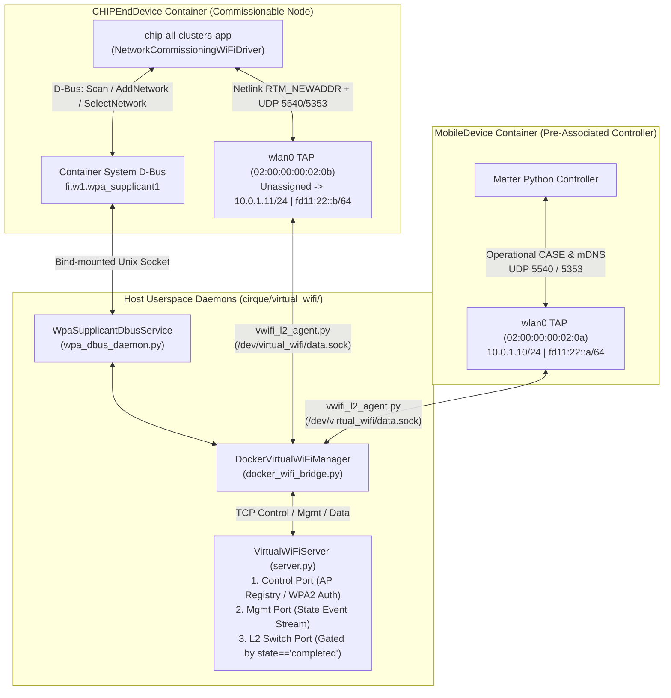

# Cirque Virtual Wi-Fi (`cirque/virtual_wifi/`) Design Document

> [!IMPORTANT]
> **Component**: `cirque/virtual_wifi/` & `cirque/capabilities/wificapability.py`
> **Default Mode**: `use_virtual_wifi_tcp=True` (Override with `CIRQUE_USE_LEGACY_HWSIM=1` for legacy `mac80211_hwsim`)
> **Zero C++ Modifications**: Works with 100% unmodified Matter Linux (`ConnectivityManagerImpl.cpp`, `NetworkCommissioningWiFiDriver.cpp`, `DiagnosticDataProviderImpl.cpp`).

---

## 1. Problem Statement & Motivation

Previously, Cirque's `WiFiCapability` and `WiFiAPNode` depended on:
1. Loading the Linux kernel **`mac80211_hwsim.ko`** module (`modprobe mac80211_hwsim radios=20`).
2. Moving kernel `phyX` wireless radios across network namespaces (`iw phy phyX set netns <pid>`).
3. Running `hostapd` and `dnsmasq` inside a special `mac80211_ap_image` container and `/usr/sbin/wpa_supplicant` inside each station container.

### Why Legacy `mac80211_hwsim` Failed on GitHub Actions CI
1. **Unavailability of `mac80211_hwsim.ko`**: GitHub Actions hosted Ubuntu runners strip `mac80211_hwsim` from the kernel image or forbid loading wireless simulation modules inside CI jobs, causing `LoadKernelError` and immediate test failure.
2. **Dangling NetNS Symlinks & Radio Exhaustion**: Crashed containers left stale `/var/run/netns/<container>` mounts and trapped `phyX` radios in dead namespaces.

---

## 2. Virtual Wi-Fi Architecture

`cirque/virtual_wifi/` applies the same userspace D-Bus + TCP switch philosophy as `cirque/virtual_bt/`, splitting Wi-Fi emulation into:
1. **Control & Management Plane (`fi.w1.wpa_supplicant1` D-Bus + TCP 802.11 Medium)** for active scanning (`ScanNetworks`), SSID/WPA2-PSK credential validation (`AddOrUpdateWiFiNetwork`), and 802.11 state transitions (`ConnectNetwork`).
2. **Association-Gated L2 Data Plane (`wlan0` TAP + TCP L2 Switch)** that drops all L2 Ethernet frames (`ARP`, `ICMPv6`, `mDNS`, `UDP/5540`) from/to unauthenticated stations and unlocks L2 frame forwarding + IPv4/IPv6 SLAAC/DHCP address assignment **only after** the station completes WPA2 4-way handshake (`state == 'completed'`).

---

## 3. Core Subcomponents & Protocol Details

### 3.1 `VirtualWiFiServer` (`cirque/virtual_wifi/server.py`)
Runs three multi-threaded TCP servers on `127.0.0.1`:
1. **Control Plane (`control_port`)**:
   - `REGISTER_AP`: Registers an AP (`ssid`, `psk`, `bssid=02:00:00:00:01:01`, `channel=6`, `frequency=2437`, `rssi=-42`, `security='WPA2-PSK'`).
   - `REGISTER_STATION`: Registers a station (`station_id`, `mac`, `ipv4_addr`, `ipv6_addr`).
   - `SCAN`: Returns all registered virtual APs for `fi.w1.wpa_supplicant1.Interface.Scan` and `ScanNetworks`.
   - `CONNECT`: Validates SSID and WPA2-PSK passphrase against the registered AP. If valid, transitions the station through `associating` -> `associated` -> `4way_handshake` -> `completed` and unlocks its port on the L2 switch. If invalid, transitions to `disconnected` (`reason=-4` `WRONG_KEY`).
   - `DISCONNECT`: Resets station state to `disconnected` and locks its L2 switch port.
2. **Management Plane (`mgmt_port`)**:
   - Pushes real-time JSON event notifications (`SCAN_DONE`, `STATE_CHANGE`) to `WpaSupplicantDbusService`.
3. **Association-Gated L2 Ethernet Switch (`data_port`)**:
   - Receives length-prefixed (`!H`) raw Ethernet frames from container `wlan0` interfaces.
   - **Strict Security Gate**: Drops any frame where the source station is not in `state == 'completed'`, and drops any frame addressed to a destination station not in `state == 'completed'`.
   - **L4 Checksum Finalization (`fix_l4_checksum`)**: Recomputes partial Linux `CHECKSUM_PARTIAL` UDP/TCP/ICMPv6 checksums across IPv4 (`0x0800`) and IPv6 (`0x86DD`) frames so receiving container kernels accept every packet over `wlan0`.

### 3.2 `WpaSupplicantDbusService` (`cirque/virtual_wifi/wpa_dbus_daemon.py`)
Attaches to each container's `/run/dbus/system_bus_socket` and owns `fi.w1.wpa_supplicant1`:
- **Root Object (`/fi/w1/wpa_supplicant1`)**:
  - Implements `GetInterface("wlan0")` -> `/fi/w1/wpa_supplicant1/Interfaces/0` and `CreateInterface(a{sv})` -> `/fi/w1/wpa_supplicant1/Interfaces/0`.
- **Interface Object (`/fi/w1/wpa_supplicant1/Interfaces/0`)**:
  - Implements `Scan`, `AddNetwork`, `SelectNetwork`, `RemoveNetwork`, `RemoveAllNetworks`, `Disconnect`, `SaveConfig`, `AutoScan`, `AddBlob`, `RemoveBlob`.
  - Exports `State`, `CurrentBSS`, `CurrentNetwork`, `CurrentAuthMode` (`WPA2-PSK`), `BSSs`, `Networks`, and `DisconnectReason`.
  - When `SelectNetwork` succeeds:
    1. Emits `PropertiesChanged` for `State='associating'` -> `'associated'`.
    2. Configures the container's `wlan0` interface with its assigned IPv4 (`10.0.1.x/24`) and IPv6 (`fd11:22::x/64` and link-local `fe80::200:ff:fe00:2xx/64`) addresses so Matter's Linux `DeviceLayer` receives netlink `RTM_NEWADDR` notifications.
    3. Emits `PropertiesChanged` for `State='completed'`, `CurrentBSS`, and `CurrentNetwork`.

### 3.3 `DockerVirtualWiFiManager` (`cirque/virtual_wifi/docker_wifi_bridge.py`)
- Creates `/dev/virtual_wifi/control.sock` and `/dev/virtual_wifi/data.sock` Unix domain proxies bind-mounted into each container.
- Creates a real `wlan0` TAP interface (`ip tuntap add dev wlan0 mode tap`) inside each container and starts `vwifi_l2_agent.py` to pump raw Ethernet frames between `wlan0` and `data.sock`.
- Installs lightweight `/usr/local/bin/iwlist` and `/usr/local/bin/dhcpcd` shims inside the container for diagnostic compatibility.

---

## 4. End-to-End Matter Commissioning Flow (`CommissionBleWiFi`)

1. **Pre-Commissioning**: `CHIPEndDevice` boots with `eth0` down and `wlan0` UP (`02:00:00:00:02:0b`, unassociated, no IPv4/ULA IPv6). Pinging `10.0.1.11` from `MobileDevice` (`10.0.1.10`) over `wlan0` fails (`100% packet loss`).
2. **BLE PASE & Network Setup**: `MobileDevice` discovers `CHIPEndDevice` over Virtual BT (`hci0`), establishes PASE over BTP v4, and sends `NetworkCommissioning::AddOrUpdateWiFiNetwork` (`SSID="CHIP-VirtualWiFi-AP"`, `PSK="ChipWiFiPassword123"`) followed by `ConnectNetwork` over `[BLE]`.
3. **D-Bus Provisioning & L2 Gate Unlock**: `CHIPEndDevice` invokes `fi.w1.wpa_supplicant1.Interface.AddNetwork` and `SelectNetwork` over D-Bus. `WpaSupplicantDbusService` authenticates with `VirtualWiFiServer`, unlocks the `wlan0` L2 switch gate, assigns `10.0.1.11/24` and `fd11:22::b/64` on `wlan0`, and emits `State='completed'`.
4. **Operational mDNS & CASE over `wlan0`**: `CHIPEndDevice` multicasts its operational `_matter._tcp.local` DNS-SD records over `wlan0`. `MobileDevice` resolves `fe80::200:ff:fe00:20b%wlan0` / `fd11:22::b%wlan0`, establishes Operational CASE over `wlan0`, sends `CommissioningComplete`, and reads/writes `NetworkCommissioning`, `WiFiNetworkDiagnostics`, `OnOff`, and `BasicInformation` clusters over `wlan0`.
