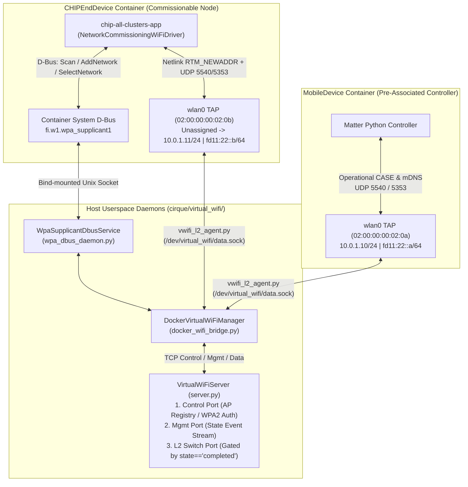

# Cirque Virtual Wi-Fi (`cirque/virtual_wifi/`) Design Document

> [!IMPORTANT]
> **Component**: `cirque/virtual_wifi/` & `cirque/capabilities/wificapability.py`
> **Default Mode**: `use_virtual_wifi_tcp=True` (Override with `CIRQUE_USE_LEGACY_HWSIM=1` for legacy `mac80211_hwsim`)
> **Zero C++ Modifications**: Works with 100% unmodified Matter Linux (`ConnectivityManagerImpl.cpp`, `NetworkCommissioningWiFiDriver.cpp`, `DiagnosticDataProviderImpl.cpp`).

---

## 1. Problem Statement & Motivation

Previously, Cirque's `WiFiCapability` and `WiFiAPNode` depended on:
1. Loading the Linux kernel **`mac80211_hwsim.ko`** module (`modprobe mac80211_hwsim radios=20`).
2. Moving kernel `phyX` wireless radios across network namespaces (`iw phy phyX set netns <pid>`).
3. Running `hostapd` and `dnsmasq` inside a special `mac80211_ap_image` container and `/usr/sbin/wpa_supplicant` inside each station container.

### Why Legacy `mac80211_hwsim` Failed on GitHub Actions CI
1. **Unavailability of `mac80211_hwsim.ko`**: GitHub Actions hosted Ubuntu runners strip `mac80211_hwsim` from the kernel image or forbid loading wireless simulation modules inside CI jobs, causing `LoadKernelError` and immediate test failure.
2. **Dangling NetNS Symlinks & Radio Exhaustion**: Crashed containers left stale `/var/run/netns/<container>` mounts and trapped `phyX` radios in dead namespaces.

---

## 2. Virtual Wi-Fi Architecture

`cirque/virtual_wifi/` applies the same userspace D-Bus + TCP switch philosophy as `cirque/virtual_bt/`, splitting Wi-Fi emulation into:
1. **Control & Management Plane (`fi.w1.wpa_supplicant1` D-Bus + TCP 802.11 Medium)** for active scanning (`ScanNetworks`), SSID/WPA2-PSK credential validation (`AddOrUpdateWiFiNetwork`), and 802.11 state transitions (`ConnectNetwork`).
2. **Association-Gated L2 Data Plane (`wlan0` TAP + TCP L2 Switch)** that drops all L2 Ethernet frames (`ARP`, `ICMPv6`, `mDNS`, `UDP/5540`) from/to unauthenticated stations and unlocks L2 frame forwarding + IPv4/IPv6 SLAAC/DHCP address assignment **only after** the station completes WPA2 4-way handshake (`state == 'completed'`).

```mermaid
flowchart TB
    subgraph Mobile["MobileDevice Container (Pre-Associated Controller)"]
        MCtrl["Matter Python Controller"]
        MWlan["wlan0 TAP (02:00:00:00:02:0a)\n10.0.1.10/24 | fd11:22::a/64"]
        MCtrl <-->|"Operational CASE & mDNS\nUDP 5540 / 5353"| MWlan
    end

    subgraph EndDev["CHIPEndDevice Container (Commissionable Node)"]
        App["chip-all-clusters-app\n(NetworkCommissioningWiFiDriver)"]
        WpaDBus["Container System D-Bus\nfi.w1.wpa_supplicant1"]
        EWlan["wlan0 TAP (02:00:00:00:02:0b)\nUnassigned -> 10.0.1.11/24 | fd11:22::b/64"]
        App <-->|"D-Bus: Scan / AddNetwork / SelectNetwork"| WpaDBus
        App <-->|"Netlink RTM_NEWADDR + UDP 5540/5353"| EWlan
    end

    subgraph Host["Host Userspace Daemons (cirque/virtual_wifi/)"]
        WpaDaemon["WpaSupplicantDbusService\n(wpa_dbus_daemon.py)"]
        DockerBridge["DockerVirtualWiFiManager\n(docker_wifi_bridge.py)"]
        VWifiSrv["VirtualWiFiServer (server.py)\n1. Control Port (AP Registry / WPA2 Auth)\n2. Mgmt Port (State Event Stream)\n3. L2 Switch Port (Gated by state=='completed')"]

        WpaDBus <-->|"Bind-mounted Unix Socket"| WpaDaemon
        WpaDaemon <--> DockerBridge
        MWlan <-->|"vwifi_l2_agent.py\n(/dev/virtual_wifi/data.sock)"| DockerBridge
        EWlan <-->|"vwifi_l2_agent.py\n(/dev/virtual_wifi/data.sock)"| DockerBridge
        DockerBridge <-->|"TCP Control / Mgmt / Data"| VWifiSrv
    end
```

---

## 3. Core Subcomponents & Protocol Details

### 3.1 `VirtualWiFiServer` (`cirque/virtual_wifi/server.py`)
Runs three multi-threaded TCP servers on `127.0.0.1`:
1. **Control Plane (`control_port`)**:
   - `REGISTER_AP`: Registers an AP (`ssid`, `psk`, `bssid=02:00:00:00:01:01`, `channel=6`, `frequency=2437`, `rssi=-42`, `security='WPA2-PSK'`).
   - `REGISTER_STATION`: Registers a station (`station_id`, `mac`, `ipv4_addr`, `ipv6_addr`).
   - `SCAN`: Returns all registered virtual APs for `fi.w1.wpa_supplicant1.Interface.Scan` and `ScanNetworks`.
   - `CONNECT` / `AUTHENTICATE`: Looks up the target AP by `ap_id` or SSID and
     starts the IEEE 802.11i WPA2-PSK 4-way handshake by sending EAPOL-Key
     message 1 to the station over `data_port` (ethertype `0x888E`). Any `psk`
     field in the request is ignored and never stored: the station derives its
     own PMK (`PBKDF2-SHA1`, `cirque/virtual_wifi/wpa2_crypto.py`), the AP
     verifies the message 2 MIC with its own PTK, wraps the GTK into message 3
     (AES key wrap), and only after a valid message 4 does the station reach
     `completed` (station states `authenticating` -> `associating` ->
     `associated` -> `4way_handshake` -> `group_handshake` -> `completed`,
     `cirque/virtual_wifi/wpa2_supplicant_sm.py`) and get its port on the L2
     switch unlocked. A wrong passphrase fails the MIC check and ends in
     `disconnected`.
   - `INITIATE_EAPOL` / `PROCESS_EAPOL`: In-process variants of the same
     handshake used by the unit tests, exchanging EAPOL frames as hex strings.
   - `DISCONNECT`: Resets station state to `disconnected` and locks its L2 switch port.
2. **Management Plane (`mgmt_port`)**:
   - Pushes real-time JSON event notifications (`SCAN_DONE`, `STATE_CHANGE`) to `WpaSupplicantDbusService`.
3. **Association-Gated L2 Ethernet Switch (`data_port`)**:
   - Receives length-prefixed (`!H`) raw Ethernet frames from container `wlan0` interfaces.
   - **Strict Security Gate**: Drops any frame where the source station is not in `state == 'completed'`, and drops any frame addressed to a destination station not in `state == 'completed'`.
   - **L4 Checksum Finalization (`fix_l4_checksum`)**: Recomputes partial Linux `CHECKSUM_PARTIAL` UDP/TCP/ICMPv6 checksums across IPv4 (`0x0800`) and IPv6 (`0x86DD`) frames so receiving container kernels accept every packet over `wlan0`.

### 3.2 `WpaSupplicantDbusService` (`cirque/virtual_wifi/wpa_dbus_daemon.py`)
Attaches to each container's `/run/dbus/system_bus_socket` and owns `fi.w1.wpa_supplicant1`:
- **Root Object (`/fi/w1/wpa_supplicant1`)**:
  - Implements `GetInterface("wlan0")` -> `/fi/w1/wpa_supplicant1/Interfaces/0` and `CreateInterface(a{sv})` -> `/fi/w1/wpa_supplicant1/Interfaces/0`.
- **Interface Object (`/fi/w1/wpa_supplicant1/Interfaces/0`)**:
  - Implements `Scan`, `AddNetwork`, `SelectNetwork`, `RemoveNetwork`, `RemoveAllNetworks`, `Disconnect`, `SaveConfig`, `AutoScan`, `AddBlob`, `RemoveBlob`.
  - Exports `State`, `CurrentBSS`, `CurrentNetwork`, `CurrentAuthMode` (`WPA2-PSK`), `BSSs`, `Networks`, and `DisconnectReason`.
  - When `SelectNetwork` succeeds:
    1. Calls `DockerVirtualWiFiManager.connect_station_to_ap`, which runs the
       station-side `Wpa2SupplicantStateMachine` for the container: it derives
       the PMK from the network's own passphrase, answers the AP's EAPOL-Key
       message 1 with message 2, verifies message 3 (MIC, replay counter,
       unwrapped GTK) and sends message 4. Every state the machine enters is
       emitted as `PropertiesChanged` on `State` (`authenticating`,
       `associating`, `associated`, `4way_handshake`, `group_handshake`,
       `completed`), together with `CurrentBSS`, `CurrentNetwork` and
       `CurrentAuthMode`.
    2. On `completed` the manager restarts `vwifi_l2_agent.py` on the
       now-unlocked switch port and starts the real `dhcpcd` on `wlan0`; the
       container obtains its IPv4 lease (`10.0.1.10` - `10.0.1.50`) from
       `VirtualDhcpServer` and its `fd11:22::/64` address via SLAAC from
       `VirtualRaServer`, so Matter's Linux `DeviceLayer` receives the usual
       netlink `RTM_NEWADDR` notifications.
    3. If the handshake fails or `completed` is never reached, `State` goes to
       `disconnected` with a non-zero `DisconnectReason`; no address is
       configured and the switch port stays locked.

### 3.3 `DockerVirtualWiFiManager` (`cirque/virtual_wifi/docker_wifi_bridge.py`)
- Creates `/dev/virtual_wifi/control.sock` and `/dev/virtual_wifi/data.sock` Unix domain proxies bind-mounted into each container.
- Creates a `wlan0 <-> vwifi_phy` `veth` pair (`ip link add wlan0 type veth peer
  name vwifi_phy`) inside each container and starts `vwifi_l2_agent.py` on
  `vwifi_phy` to pump raw Ethernet frames between `wlan0` and `data.sock`.
- Runs the AP-side `VirtualDhcpServer` (RFC 2131, server `10.0.1.1`, pool
  `10.0.1.10` - `10.0.1.50`) and `VirtualRaServer` (RFC 4861 router
  advertisements for `fd11:22::/64`) on the L2 data plane, so stations use
  their real DHCP client and SLAAC instead of pre-assigned addresses.
- Installs a lightweight `/sbin/iwlist` (`/usr/sbin/iwlist`) inside the
  container that renders `iwlist wlan0 scan` output from the live AP registry
  (`list_aps`, including each AP's signal level); there is no `dhcpcd` shim.

### 3.4 TAP Stations for the Android Emulator (`cirque_tap0`)
The Android emulator attaches its virtio Wi-Fi device to a TAP interface in the
container (`-wifi-tap cirque_tap0`) instead of a `veth` pair. For such a
station (`is_tap_station=True` on the node) the manager:
- runs `vwifi_l2_agent.py` on `cirque_tap0` so the guest's raw Ethernet frames
  reach `data.sock`, and restarts it (never a `vwifi_phy` agent) after the
  handshake;
- performs the WPA2 EAPOL handshake for the station from the host side with the
  same `Wpa2SupplicantStateMachine`, because the guest kernel keeps its own
  802.11 association internal to the emulator;
- leaves DHCP to the guest: Android's own DHCP client on guest `wlan0` obtains
  the `10.0.1.x` lease from `VirtualDhcpServer`, and `AndroidDockerNode`
  installs guest policy routes so `10.0.1.0/24`, multicast DNS and CASE
  (UDP 5540) use `wlan0` rather than the emulator's `eth0` NAT.

---

## 4. End-to-End Matter Commissioning Flow (`CommissionBleWiFi`)

1. **Pre-Commissioning**: `CHIPEndDevice` boots with `eth0` down and `wlan0` UP (`02:00:00:00:02:0b`, unassociated, no IPv4/ULA IPv6). Pinging `10.0.1.11` from `MobileDevice` (`10.0.1.10`) over `wlan0` fails (`100% packet loss`).
2. **BLE PASE & Network Setup**: `MobileDevice` discovers `CHIPEndDevice` over Virtual BT (`hci0`), establishes PASE over BTP v4, and sends `NetworkCommissioning::AddOrUpdateWiFiNetwork` (`SSID="CHIP-VirtualWiFi-AP"`, `PSK="ChipWiFiPassword123"`) followed by `ConnectNetwork` over `[BLE]`.
3. **D-Bus Provisioning & L2 Gate Unlock**: `CHIPEndDevice` invokes `fi.w1.wpa_supplicant1.Interface.AddNetwork` and `SelectNetwork` over D-Bus. `WpaSupplicantDbusService` authenticates with `VirtualWiFiServer`, unlocks the `wlan0` L2 switch gate, assigns `10.0.1.11/24` and `fd11:22::b/64` on `wlan0`, and emits `State='completed'`.
4. **Operational mDNS & CASE over `wlan0`**: `CHIPEndDevice` multicasts its operational `_matter._tcp.local` DNS-SD records over `wlan0`. `MobileDevice` resolves `fe80::200:ff:fe00:20b%wlan0` / `fd11:22::b%wlan0`, establishes Operational CASE over `wlan0`, sends `CommissioningComplete`, and reads/writes `NetworkCommissioning`, `WiFiNetworkDiagnostics`, `OnOff`, and `BasicInformation` clusters over `wlan0`.
